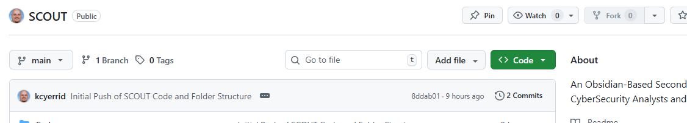
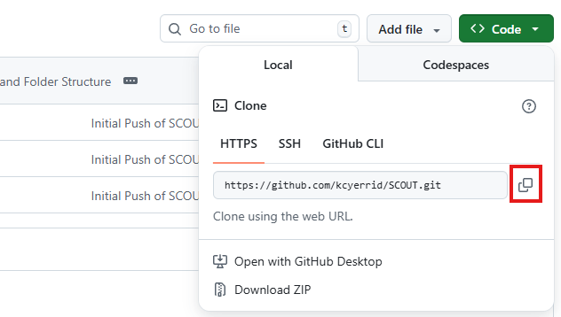

# Cloning the SCOUT repo

## Cloning the SCOUT repository

1. Navigate to the [main page of the SCOUT GitHub repository](https://www.github.com/kcyerrid/SCOUT).
2. Above the list of files, click **<> Code.**

3. Copy the URL for the repository.
    * To clone the repository using HTTPS, under "HTTPS", click .
    * To clone the repository using an SSH key, including a certificate issued by your organization's SSH certificate authority, click **SSH**, then click .
    * To clone the repository using GitHub CLI, click GitHUb CLI, then click .
    
4. Open Git Bash
5. Change the current working directory to the location where you want the cloned directory.
6. Type `git clone`, and then paste the URL you copied in Step 3.  
```os  
git clone https://github.com/kcyerrid/SCOUT
```
7. Press **Enter** to create your local clone.


