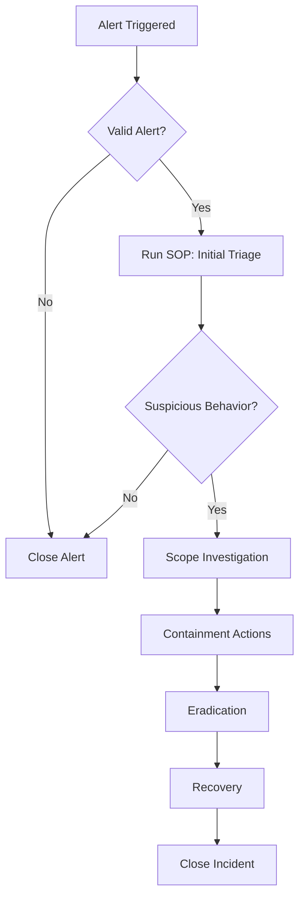

# {{title}}

## 1. Purpose
Describe:
- Why this playbook exists  
- The operational problem it solves  
- When analysts should use it  
- The outcomes it is designed to achieve  

Example:
> “This playbook defines the end-to-end process for investigating and responding to a suspicious authentication event, including triage, scoping, containment, and recovery.”

---

## 2. Scope & Applicability
Document:
- Incident categories/types this applies to  
- Severity levels covered  
- Systems/platforms implicated (Azure AD, Okta, EDR, VPN, Cloud)  
- Situations where this playbook should not be used  

---

## 3. Prerequisites
List everything required before executing the playbook:

- Required permissions  
- Required alerts or evidence  
- SOPs to review first  
- Approvals needed  
- Preconditions (e.g., ensure you have access to identity logs)

---

## 4. High-Level Workflow Diagram (Optional)
Use a simple textual representation or Mermaid diagram.

Example:

## 5. Detailed Playbook Steps

Break the playbook into **phases**, each referencing relevant SOPs.

### Phase 1 — Detection & Triage
1. Perform triage according to SOP-Triage-Initial.
2. Validate the triggering alert and confirm malicious or suspicious context.
3. Enrich alert data with identity, endpoint, and network telemetry.
4. Document initial findings in an Investigation entry.

### Phase 2 — Scoping & Analysis
5. Determine the scope using identity logs, endpoint data, and network metadata.
6. Apply SOP-Identity-Analysis.
7. Log pivotal observations using Observation entries.

### Phase 3 — Containment
8. Execute containment tasks using the appropriate SOPs.
9. Validate containment success.

### Phase 4 — Eradication & Recovery
10. Remove malicious artifacts per SOP-Eradication-Host.
11. Reset credentials or rotate secrets if required.
12. Verify system recovery.

### Phase 5 — Closure & Documentation
13. Complete Incident entry documentation.
14. Tag all linked entities (alerts, observations, response actions).
15. Record lessons learned if severity > medium.

## 6. Decision Points

Document where analysts need to make choices.

Example:

### Decision 1 — Is the authentication activity clearly malicious?
If yes → proceed to containment phase.
If no → gather additional logs and re-evaluate.

### Decision 2 — Does the asset show signs of compromise?
If yes → isolate endpoint.
If no → continue monitoring.

Clear decision points remove ambiguity

## 7. Required SOP References

List SOPs used by this playbook:
- SOP-Initial-Triage
- SOP-Identity-Analysis
- SOP-Endpoint-Isolation
- SOP-Containment-Network
- SOP-Eradication-Host

This ensures modularity and reuse.

---

## 8. Automation Opportunities

Describe:

- Which steps could be SOAR-automated
- Which enrichment steps could be scripted
- Any risks in automation
- Any required human approvals

Example:

> “IP reputation checks can be automated via SOAR, but containment must require human approval.”

---

## 9. Risk & Considerations

Document operational risks:

- Over-isolation of assets
- Impact to business users
- Forensic impact
- Identity lockouts
- Cloud resource disruption

Also include:

- Regulatory concerns
- Data handling cautions

---

## 10. Metrics & Success Criteria

This is where the SOC integrates process with measurement.

Track:

- MTTD for applicable alerts
- MTTR for incidents triggered via this playbook
- Containment time
- SOP adherence
- Detection fidelity

Define indicators of successful execution.

---

## 11. Revision History

Track changes to maintain quality and auditability.

|Version|Date|Author|Changes|
|---|---|---|---|
|1.0|{{date}}|your_name|Initial release|